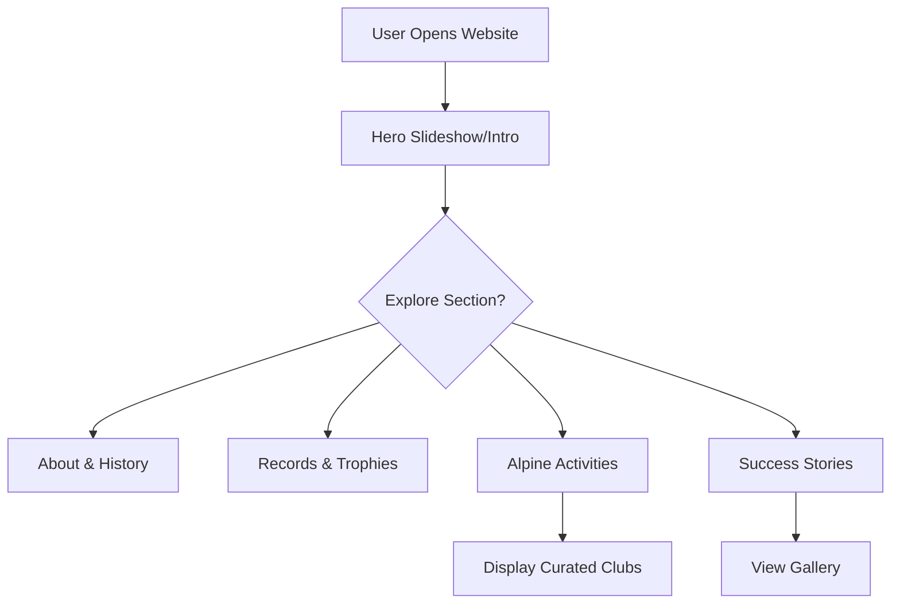
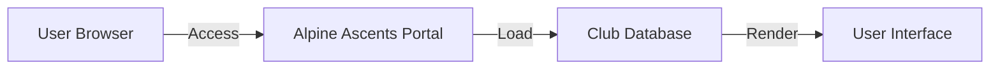

# Project Deliverables: Alpine Ascents Mountaineering Portal

## 1. Problem Definition
The mountaineering community lacks a centralized, modern, and interactive platform that provides both global information (records, history, safety) and localized resources (clubs, activities). **Alpine Ascents** addresses this by providing a comprehensive portal that educates users on mountaineering, tracks global records, offers safety guidelines, and showcases a curated list of major mountaineering organizations.

## 2. Design Specifications
### Tech Stack
- **Frontend**: HTML5, CSS3, JavaScript (ES6+).
- **Frameworks/Libraries**:
  - **Bootstrap 5**: For responsive layout and grid systems.
  - **AOS (Animate On Scroll)**: For smooth entry animations.
  - **Font Awesome 6**: For scalable vector icons.
  - **Leaflet.js**: For interactive mapping capabilities.
  - **IP-API / ipapi.co**: For geolocation services.

### Design Principles
- **Responsive Design**: Mobile-first approach ensuring compatibility across desktops, tablets, and smartphones.
- **Visual Storytelling**: High-quality imagery and video backgrounds to evoke the adventurous spirit of mountaineering.
- **Dynamic Content**: Auto-updating visit counters and curated club recommendations.

## 3. Diagrams
### Activity Flowchart (User Interaction)

### Data Flow Diagram

## 4. Source Code Overview
- **`index.html`**: Core structure of the portal, including all sections (Hero, About, Records, Activities, Stories, Gallery, Developments, Guidelines).
- **`css/`**:
  - `base.css`: Typography, colors, and root variables.
  - `layout.css`: Structural styles (header, footer, grid).
  - `sections.css`: Specific styles for each content section.
  - `components.css`: Reusable UI elements (cards, buttons).
- **`js/`**:
  - `main.js`: General UI logic and initialization.
  - `slideshow.js`: Logic for the hero image slider.
  - `status.js`: Dynamic date/time and visit tracking.
  - `local-activities.js`: Core logic for displaying curated mountaineering club data.

## 5. Test Data Used
The project utilizes a curated dataset of:
- **Global Records**: Highest peaks, fastest ascents, and notable climbers.
- **Clubs & Camps**: A list of 9 major mountaineering organizations spanning the UK, USA, India, Italy, Nigeria, and Ghana.
- **Success Stories**: Real-world expedition results and charity climbs with high-quality media.

## 6. Project Installation Instructions
1. **Prerequisites**: No specialized server environment is required. A modern web browser (Chrome, Firefox, Safari, or Edge) is sufficient.
2. **Setup**:
   - Clone or download the project repository.
   - Ensure the directory structure (css, js, images) remains intact.
3. **Execution**:
   - Double-click `index.html` to open the site in your default browser.
   - The project is fully functional offline after initial asset loading, with all features available immediately.

## 7. Assumptions
- Users have an active internet connection to load external libraries (Bootstrap, Font Awesome, Google Fonts).

---
**Note**: Video demonstration and live URL are provided separately as part of the submission package.
